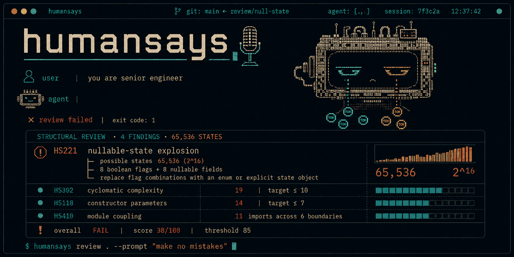

# humansays



[](https://github.com/rhawk117/humansays/actions/workflows/integration.yml)
[](https://pypi.org/project/humansays/)
[](https://pypi.org/project/humansays/)
[](https://github.com/rhawk117/humansays/blob/main/LICENSE)

A python linter which evaluates how difficult AI generated code is to read,
understand, test, maintain, and safely modify. It gives coding agents
actionable and easy to reason about feedback on design problems that
traditional linters, type checkers, and tests cannot detect.

!!! warning "Early development"

    This is `0.1.0a1`. The rule identifiers, the configuration schema, and
    the JSON output shape will change before `0.1.0`. Do not pin automation
    to `HS###` codes yet.

## Install

There are no runtime dependencies and no extras. The package is on PyPI as
[`humansays`](https://pypi.org/project/humansays/) and needs Python 3.11 or
newer.

<!-- termynal -->

```console
$ pip install humansays
---> 100%
Successfully installed humansays-0.1.0a1
```

## Run it

Point it at a file or a directory.

<!-- termynal -->

```console
$ humansays src/humansays/reporting/
Python investigation targets src/humansays/reporting/
files=9 lines=550 targets=5 errors=0
score 91.0 (A)  penalty 4.1 over 550 lines  density 0.745/100 lines
src/humansays/reporting/ansi.py:28-33  _style  boolean-modes
src/humansays/reporting/ansi.py:36-48  indicator_text  boolean-modes
src/humansays/reporting/ansi.py:51-62  score_text  boolean-modes
src/humansays/reporting/ansi.py:65-94  unanalyzed_lines  boolean-modes
src/humansays/reporting/ansi.py:97-130  report_lines  boolean-modes
```

Each line is a location, a symbol, and the signals that fired against it.
[Output and scoring](output.md) explains the score, the grade, and the JSON
shape.

## What it looks at

A linter checks whether a line is written correctly. A type checker checks
whether values fit together. Neither has an opinion about whether a function
has quietly accumulated four jobs. That gap is what this tool reports on, and
it reports on four things in particular.

**How many jobs a unit has taken on.** Argument count, branch count, nesting
depth, and body length are each weak on their own. Together they describe a
function that grew past what one name can honestly describe. See
[Function shape](rules/function-shape.md).

**Who is allowed to mutate a piece of state.** Module-level mutable bindings
and attributes written from several different methods both mean the same
thing: no single place owns the value, so no single place can be held
responsible when it is wrong. See
[State and boundaries](rules/state-and-boundaries.md).

**Which side effects a unit reaches.** A function that touches the filesystem,
the network, a database, and a subprocess cannot be tested without standing
all four up. The tool counts the standard-library boundaries a body reaches
and reports when they pile up in one place. See
[State and boundaries](rules/state-and-boundaries.md).

**How much a reader has to hold in their head.** Attribute count, base class
count, and how many of a class's methods actually touch its own state all
measure the same thing from different angles: the cost of understanding one
piece without reading the rest. See [Class design](rules/class-design.md).

## How a finding is framed

A finding is a location, a weighted score, and a review question. It is not a
verdict, and the tool does not tell you what to do.

Every rule in `src/humansays/rules/*/rules.toml` carries a `review_question`,
and that question is the point of the rule. For `HS001`, too many arguments:

> Do these values form a request object, reusable configuration, or multiple
> responsibilities?

For `HS004`, shared mutable state:

> Is the lifetime intentional, who owns mutation, and can tests isolate this
> state?

All three answers to the first question are legitimate. The rule cannot tell
which one applies, and it does not try to. It marks the spot and names the
question a reviewer should be asking there.

## What it cannot do

Three limits are worth stating plainly, because they bound everything above.

Syntax cannot prove intent. A function with eight arguments may be exactly
right for its job. The tool reports the shape, not a defect.

Syntax cannot prove runtime effects. Reaching a `subprocess` import in a body
is evidence that the function may run a process, not proof that it does.

Syntax cannot prove authorship. Nothing here detects whether a model wrote the
code. It detects structure, and structure is the same whoever produced it.

This is not a replacement for a type checker, and it is not a general linter.
Run it alongside those, not instead of them.

## Where to go next

- [Getting started](getting-started.md), installing it and reading the first run
- [Configuration](configuration.md), every key and its default
- [CLI](cli.md), every flag
- [Rules](rules/index.md), all 19 shipped rules with what triggers each one
- [Design philosophy](philosophy/index.md), the model of working code the rules encode
