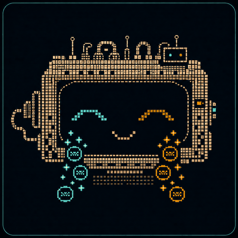

# Design philosophy

{ align=right width="200" }

This section states the model of how code should work that the rules encode. The
shipped `HS###` rules are the automated subset of that model: the part whose
condition can be read off the syntax tree without guessing. The rest of the
criteria stay here as prose, and they are useful to a reviewer whether or not
the tool is ever run against the file in front of them.

## Purpose

Use this document when writing or reviewing Python functions and classes. It defines criteria for readable, cohesive, testable code without encouraging excessive abstraction or fragmented one-line helpers.

The central rule is:

> Keep code together when it expresses one complete idea. Separate it when a part has its own responsibility, state, lifecycle, failure mode, or reason to change.

These criteria are review signals, not mechanical limits. A cohesive 60-line parser can be better than twelve five-line functions spread across several modules.

## 1. Classify the Unit

Before reviewing an implementation, identify its dominant role.

### Functions

A function should primarily perform one of these roles:

- **Calculation:** derives a result without side effects.
- **Query:** reads state without intentionally changing it.
- **Command:** changes state.
- **Boundary operation:** performs database, filesystem, network, subprocess, or similar I/O.
- **Workflow:** coordinates several domain operations or boundaries.
- **Construction:** creates a valid object.

### Classes

A class should have one dominant role:

| Kind               | Primary responsibility                  | Default design                                |
| ------------------ | --------------------------------------- | --------------------------------------------- |
| Value object       | Represent a meaningful value            | Immutable and validated                       |
| DTO                | Carry data across a boundary            | Simple and usually immutable                  |
| Entity             | Preserve identity while state changes   | Controlled domain transitions                 |
| State owner        | Manage a mutable collection or resource | Private state and narrow API                  |
| Policy or strategy | Make one decision                       | Deterministic and replaceable                 |
| Use case           | Execute one application operation       | Explicit dependencies; minimal retained state |
| Repository         | Persist and retrieve domain state       | Hide storage details                          |
| Adapter or gateway | Communicate with an external system     | Translate at the boundary                     |
| Coordinator        | Order several operations                | Delegate decisions and I/O                    |
| Factory            | Select or construct objects             | Hide meaningful construction rules            |

If the function or class cannot be classified, it may combine unrelated responsibilities.

## What enforces this

No shipped rule reads a function's or a class's role directly, because a role is
not a syntactic property. Four rules detect structures that commonly appear when
a unit has more than one role, and each one raises the question this page asks:

| Code  | Signal                     | What it observes                                                                                             | Page                                                                            |
| ----- | -------------------------- | ------------------------------------------------------------------------------------------------------------ | ------------------------------------------------------------------------------- |
| HS007 | `mixed-boundaries`         | One function performs more than one kind of I/O, so a boundary operation and a workflow occupy the same body | [State and boundaries](../rules/state-and-boundaries.md#hs007-mixed-boundaries) |
| HS008 | `low-class-cohesion`       | Methods split into groups that touch disjoint attributes, which is what two roles in one class looks like    | [Class design](../rules/class-design.md#hs008-low-class-cohesion)               |
| HS013 | `attribute-prefix-cluster` | Attribute names cluster by prefix, a common shape when several responsibilities share one namespace          | [Class design](../rules/class-design.md#hs013-attribute-prefix-cluster)         |
| HS018 | `many-base-classes`        | A class inherits several bases, so its dominant role is assembled rather than stated                         | [Class design](../rules/class-design.md#hs018-many-base-classes)                |

Nothing here decides whether the classification is wrong. The rules mark the
location; the reviewer answers the question.

## References

- Bertrand Meyer's command-query separation, the source of the query and command
    split above, as summarized by Martin Fowler in
    [Command Query Separation](https://martinfowler.com/bliki/CommandQuerySeparation.html).
- Robert C. Martin,
    [The Single Responsibility Principle](https://blog.cleancoder.com/uncle-bob/2014/05/08/SingleReponsibilityPrinciple.html),
    for "one reason to change" as the test for splitting a unit.
- Martin Fowler, [Value Object](https://martinfowler.com/bliki/ValueObject.html),
    for the immutability default in the class table.
